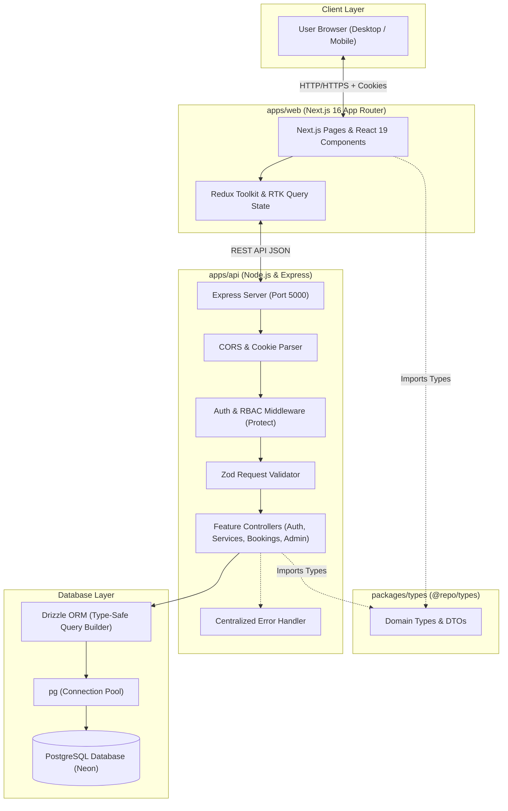
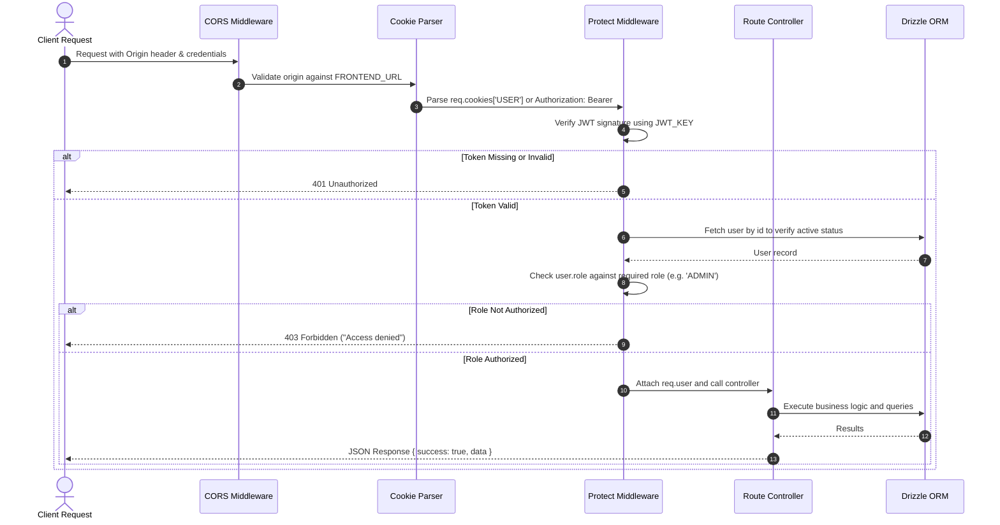

# System Architecture: Service Booking System

This document outlines the end-to-end technical architecture, component flow, security layers, and data handling pipeline of the Service Booking System.

---

## High-Level Architecture Overview

The system is structured as a TypeScript Turborepo monorepo comprising a modern Next.js frontend, an Express REST API backend, a shared types package, and a managed PostgreSQL database.



---

## Architectural Principles

1. **Single Source of Truth**: The PostgreSQL database and backend business logic are the sole authority on pricing, durations, slot availability, and booking ownership. Frontend client values for price or duration are never trusted.
2. **Shared Contract (`@repo/types`)**: Both client and server import strong TypeScript definitions from `packages/types`, preventing type divergence or ad-hoc duplicate interfaces.
3. **Defense in Depth**: Every API endpoint enforces authentication, role authorization, parameter/body validation via Zod, and granular resource ownership checks before performing database operations.
4. **Relational Integrity**: Foreign keys, unique constraints, and PostgreSQL native data types (`date`, `time`, `numeric`, `timestamptz`) are leveraged to enforce data consistency at the database engine level.

---

## Core Flows

#### Registration Pipeline
```
Register Request
  ↓
Zod Input Validation (Name, Email, Password)
  ↓
PostgreSQL Email Lookup (Duplicate Prevention)
  ↓
bcrypt Password Hashing (Salt Rounds: 10)
  ↓
PostgreSQL User Insertion (Enforce role = 'CUSTOMER')
  ↓
JWT Signing (id, role) & Set-Cookie (HTTP-only)
  ↓
Safe User Response (Password Excluded, 201 Created)
```

#### Login Pipeline
```
Login Request
  ↓
Zod Input Validation (Email, Password)
  ↓
PostgreSQL User Lookup by Normalized Email
  ↓
bcrypt Password Comparison
  ↓
JWT Generation using JWT_KEY (7d expiry)
  ↓
HTTP-only Cookie Attachment (SameSite=Lax, Secure in Prod)
  ↓
Safe User Response (Password Excluded, 200 OK)
```

#### Authenticated Request Pipeline
```
Incoming Client Request
  ↓
Read HTTP-only Cookie (name = USER) or Authorization: Bearer Header
  ↓
Verify JWT Signature using JWT_KEY
  ↓
PostgreSQL User Verification by Decoded ID
  ↓
Attach req.user (Safe User Object, no any)
  ↓
Downstream Controller Execution
```

### 2. Authorization & Request Pipeline



### 3. Error Handling Flow

* All asynchronous controllers wrap execution or delegate unhandled errors to the centralized `errorHandler` middleware.
* **Validation Errors (Zod)**: Format invalid fields into clean error maps with HTTP `400 Bad Request`.
* **Resource Conflicts (409)**: Booking slot collisions or duplicate registrations return explicit HTTP `409 Conflict`.
* **Not Found (404)**: Non-existent services or bookings return clear `404 Not Found`.
* **Internal Errors (500)**: Mask database queries, credentials, and raw stack traces in production, logging safely to server console while delivering a sanitized message to clients.

---

## 4. Service Management Architecture (Phase 5)

### Public vs. Admin Isolation
* **Public Service Visibility**: The public catalog endpoints (`GET /api/services` and `GET /api/services/:id`) strictly query `where(eq(services.isActive, true))`. If an inactive service ID is queried, the API immediately returns `404 Not Found`.
* **Admin Privilege & RBAC**: Admin service endpoints (`/api/admin/services/*`) are protected via `protect("ADMIN")`. Non-admin customers receive `403 Forbidden`. Admin listing endpoints allow viewing both active and inactive services.

### Soft-Delete Pattern
* To protect relational integrity and prevent breaking historical or future bookings (`ON DELETE RESTRICT` constraint), services are **never physically deleted**.
* Calling `DELETE /api/admin/services/:id` executes a soft delete: setting `isActive = false` and updating `updatedAt`.
* If a service is already deactivated, the backend returns a clean response without modifying or corrupting records.

### Frontend State Architecture (`apps/web`)
* Built on Next.js 16 App Router, React 19, Redux Toolkit, and RTK Query.
* **Cache Tag Invalidation**: Service mutations (`createService`, `updateService`, `deleteService`) automatically invalidate `['Services', { type: 'Service', id }]` cache tags, triggering immediate background refetches for all active catalog and admin table views.
* **Forms & Validation**: Implemented with React Hook Form paired with Zod resolvers ensuring client-side validation mirrors server-side schemas.

---

## 5. Availability & Secure Booking Engine Architecture (Phase 6 & 7)

### Availability Engine (`GET /api/services/:id/availability`)
* Computes candidate appointment slots based on standard business hours (`09:00` to `18:00`) and the service's database `duration`.
* Only slots that fit completely within business hours (`endTime <= 18:00`) are generated.
* Evaluates slot collisions against existing database bookings using the mathematical overlap test:
  $$\text{Overlap} \iff \text{newStart} < \text{existingEnd} \quad \text{AND} \quad \text{newEnd} > \text{existingStart}$$
* **Status Blocking Rules**:
  * `PENDING`, `CONFIRMED`, and `COMPLETED` bookings block the requested slot.
  * `CANCELLED` bookings are ignored and release the slot.
  * For today's date, slots starting in the past are marked unavailable.

### Concurrency Protection & Double-Booking Prevention
* Booking creation (`POST /api/bookings`) executes within an atomic PostgreSQL transaction (`db.transaction`).
* **Advisory Lock Serialization**:
  ```sql
  SELECT pg_advisory_xact_lock(hashtext(serviceId || bookingDate));
  ```
  This serializes concurrent transactions booking the same service on the same date.
* Inside the lock, the backend re-queries active bookings, evaluates the overlap condition, and throws `ConflictError` (HTTP 409) if a collision is detected.
* Zero race conditions or double-bookings can occur even under high concurrent load.

### Price & Duration Authority
* The backend recalculates `endTime = startTime + duration` and reads `amount = service.price` directly from PostgreSQL.
* Any client-sent `amount`, `endTime`, `customerId`, or `status` is discarded.

### Data Ownership & Cancellation Lifecycle
* `GET /api/bookings/my` filters strictly by authenticated user (`req.user.id`).
* `GET /api/bookings/:id` and `PATCH /api/bookings/:id/cancel` enforce ownership via `assertOwnership(req.user, booking.customerId)`.
* Only `PENDING` and `CONFIRMED` appointments can be cancelled. `COMPLETED` bookings return `400 Bad Request`. Cancelled appointments update `status = 'CANCELLED'` and are preserved in PostgreSQL for auditing.

---

## 6. Admin Booking Management & Analytics Dashboard (Phase 8)

### Multi-Dimensional Query & Filter Pipeline
* **Query Builder**: Dynamic SQL condition composition in Drizzle ORM:
  * `eq(bookings.status, status)`
  * `eq(bookings.bookingDate, date)`
  * `eq(bookings.serviceId, serviceId)`
  * `or(ilike(users.name, %search%), ilike(users.email, %search%))`
* **Pagination & Ordering**: Standardized `limit` / `offset` calculations accompanied by a parallel `count()` query returning total items and total pages. Orders newest first (`desc(bookings.createdAt)`), utilizing the `bookings_created_at_idx` index.
* **Relational Joins**: Automatically joins both `users` (customer details) and `services` (catalog item, price, duration), standardizing all client outputs through `formatBooking()`.

### Status Transition Engine & Advisory Locked Confirmation
* **State Machine Rules**:
  * `PENDING` $\rightarrow$ `CONFIRMED` | `CANCELLED`
  * `CONFIRMED` $\rightarrow$ `COMPLETED` | `CANCELLED`
  * Terminal states (`COMPLETED`, `CANCELLED`) reject status transitions with `400 Bad Request`.
* **Advisory Locked Collision Check**:
  * When an admin confirms a booking (`PATCH /api/admin/bookings/:id/status` with `status = 'CONFIRMED'`), execution enters a transaction acquiring `pg_advisory_xact_lock(hashtext(serviceId || bookingDate))`.
  * Checks for overlaps against other active bookings (`PENDING`, `CONFIRMED`, `COMPLETED` where `id != bookingId`).
  * If an overlap is detected, the transaction aborts with HTTP `409 Conflict`, preventing administrative double-confirmations.

### Real-Time Database Metrics & Realized Revenue
* `GET /api/admin/dashboard/stats` calculates all metrics dynamically from PostgreSQL:
  * Status breakdown: `count()` filtered by status (`PENDING`, `CONFIRMED`, `COMPLETED`, `CANCELLED`).
  * Volume: `count()` of customers (`role = 'CUSTOMER'`) and active services (`isActive = true`).
  * Realized Revenue: `COALESCE(SUM(amount), 0)` strictly on `COMPLETED` appointments, ensuring reported income represents realized revenue.
  * Summary: Counts for today's and upcoming appointments, paired with the 5 most recent platform bookings.

