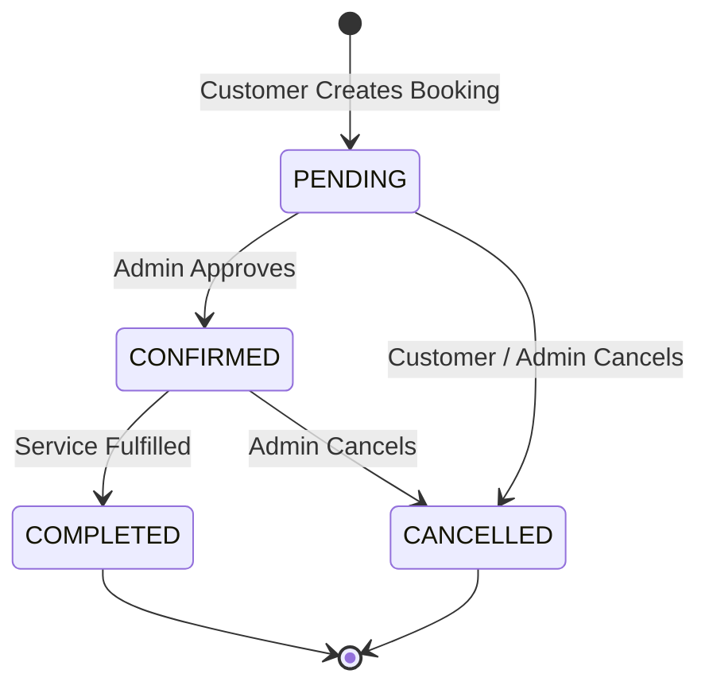

# Booking Business Logic & Security Rules

This document specifies the core booking business logic, security constraints, overlap detection algorithms, and state machine transitions for the Service Booking System.

---

## The Core Rule: Backend Is The Sole Authority

Client applications and frontend interfaces are completely untrusted. Clients send only intent:

```json
{
  "serviceId": "UUID",
  "bookingDate": "2026-09-15",
  "startTime": "10:00"
}
```

Any client-supplied fields attempting to specify `amount`, `endTime`, `customerId`, `price`, `duration`, or `status` are **completely ignored** and discarded by the backend.

---

## Booking Creation Pipeline (17-Step Verification)

When a customer submits a booking request to `POST /api/bookings`, the backend executes the following atomic sequence:

```
[1. Authenticate Request]
       ↓
[2. Verify Role is CUSTOMER]
       ↓
[3. Validate Inputs (UUID, YYYY-MM-DD, HH:mm)]
       ↓
[4. Query Service from PostgreSQL]
       ↓
[5. Verify Service Exists & is_active = true]
       ↓
[6. Read Authoritative Duration & Price from DB]
       ↓
[7. Compute endTime: startTime + duration]
       ↓
[8. Compute amount: service.price]
       ↓
[9. Check Operating Hours (e.g. 09:00 to 18:00)]
       ↓
[10. Check Against Existing Active Bookings (PENDING & CONFIRMED)]
       ↓
[11. Detect Exact Duplicate Bookings]
       ↓
[12. Detect Overlapping / Colliding Bookings]
       ↓
[13. Final Re-verification in Transaction]
       ↓
[14. Insert Booking into PostgreSQL with status = 'PENDING']
       ↓
[15. Return 201 Created with Persisted Booking Record]
```

---

## Overlapping Booking Prevention Algorithm

### Overlap Condition
Two time intervals $[S_1, E_1)$ and $[S_2, E_2)$ collide if and only if:
$$\text{Overlap} \iff S_{\text{new}} < E_{\text{existing}} \quad \text{AND} \quad E_{\text{new}} > S_{\text{existing}}$$

Only active bookings (statuses `PENDING` and `CONFIRMED`) block availability. Cancelled (`CANCELLED`) or past completed (`COMPLETED`) bookings on different dates do not block future appointments.

### Concrete Scenarios

Assume an existing booking for a service on **2026-09-15** is scheduled from **10:00 to 11:00**:

| Requested Slot | Condition Checked | Result | Reason |
| :--- | :--- | :--- | :--- |
| **10:00 $\rightarrow$ 11:00** | $10:00 < 11:00$ AND $11:00 > 10:00$ | **REJECT (409 Conflict)** | Exact duplicate collision |
| **10:30 $\rightarrow$ 11:30** | $10:30 < 11:00$ AND $11:30 > 10:00$ | **REJECT (409 Conflict)** | Starts during existing booking |
| **09:30 $\rightarrow$ 10:30** | $09:30 < 11:00$ AND $10:30 > 10:00$ | **REJECT (409 Conflict)** | Ends during existing booking |
| **09:00 $\rightarrow$ 11:00** | $09:00 < 11:00$ AND $11:00 > 10:00$ | **REJECT (409 Conflict)** | Envelops existing booking |
| **10:30 $\rightarrow$ 10:45** | $10:30 < 11:00$ AND $10:45 > 10:00$ | **REJECT (409 Conflict)** | Falls entirely within existing booking |
| **11:00 $\rightarrow$ 12:00** | $11:00 < 11:00$ (False) | **ALLOW (Valid)** | Starts exactly when previous booking finishes |
| **09:00 $\rightarrow$ 10:00** | $10:00 > 10:00$ (False) | **ALLOW (Valid)** | Finishes exactly when next booking begins |

---

## Price & Financial Security

* **Attack Scenario**: A malicious user intercepts network requests and sends:
  ```json
  {
    "serviceId": "e58ed763-928c-4155-bee9-fd920fb59b10",
    "bookingDate": "2026-09-20",
    "startTime": "14:00",
    "amount": 0.01,
    "endTime": "14:05"
  }
  ```
* **Backend Defense**:
  * The backend controller completely ignores the incoming `amount` and `endTime` keys.
  * It pulls `service.price` and `service.duration` directly from the PostgreSQL `services` row.
  * The persisted `amount` is guaranteed to equal the actual catalog price at time of booking.

---

## Availability Slot Calculation & Concurrency Strategy

* **Endpoint**: `GET /api/services/:id/availability?date=YYYY-MM-DD`
* **Algorithm**:
  1. Verify the service exists and is active.
  2. Retrieve `duration` (e.g. 45 or 60 minutes).
  3. Generate business operating slots within working hours (`09:00` to `18:00`).
  4. Query PostgreSQL `bookings` for the given `date` and `service_id` where `status != 'CANCELLED'` (`PENDING`, `CONFIRMED`, and `COMPLETED` bookings block slots; `CANCELLED` bookings do not block slots).
  5. For each candidate slot, test against all active bookings using the overlap condition: `newStart < existingEnd AND newEnd > existingStart`.
  6. Return an array of slots indicating `{ startTime, endTime, isAvailable }`.
  7. When a customer clicks "Book", the backend **re-evaluates availability immediately inside a serializing transaction**.

### PostgreSQL Transaction & Advisory Locking Concurrency Protection
To prevent race conditions where two customers attempt to book the exact same slot at the same millisecond:
1. Creation runs inside `db.transaction(async (tx) => { ... })`.
2. The transaction immediately acquires a transaction-level exclusive advisory lock:
   ```sql
   SELECT pg_advisory_xact_lock(hashtext(serviceId || bookingDate));
   ```
3. This serializes all concurrent booking attempts for that specific service and date.
4. Inside the locked block, active bookings are re-queried and tested against the overlap formula.
5. If any conflict exists, the transaction throws `ConflictError` (HTTP 409) and rolls back cleanly without database corruption.
6. The advisory lock releases automatically on `COMMIT` or `ROLLBACK`.

---

## Customer Ownership & Data Isolation

* A customer can access **only their own** bookings.
* `GET /api/bookings/my` filters strictly by `customerId = req.user.id`.
* `GET /api/bookings/:id` checks:
  ```typescript
  if (user.role !== 'ADMIN' && booking.customerId !== user.id) {
    throw new ForbiddenError("You are not authorized to view this booking");
  }
  ```
* `PATCH /api/bookings/:id/cancel`:
  * Verifies `booking.customerId === req.user.id`.
  * Cannot cancel bookings that have already been marked `COMPLETED` or are already `CANCELLED`.
  * Status is updated to `CANCELLED`.

---

## Admin Booking Status State Machine

Administrators can transition booking statuses according to strict business state rules. Arbitrary status jumps are rejected:



### Transition Validation Rules

| Current Status | Allowed Target Statuses | Disallowed Target Statuses |
| :--- | :--- | :--- |
| **`PENDING`** | `CONFIRMED`, `CANCELLED` | `COMPLETED` |
| **`CONFIRMED`** | `COMPLETED`, `CANCELLED` | `PENDING` |
| **`COMPLETED`** | *None (Terminal)* | `PENDING`, `CONFIRMED`, `CANCELLED` |
| **`CANCELLED`** | *None (Terminal)* | `PENDING`, `CONFIRMED`, `COMPLETED` |

Attempting an invalid status jump (e.g. `COMPLETED` $\rightarrow$ `PENDING`) returns `400 Bad Request` with an explanatory message.

### Collision Check on Admin Confirmation
When an administrator transitions a booking to `CONFIRMED`:
1. The transition runs inside a PostgreSQL transaction.
2. A transaction-level advisory lock is acquired: `SELECT pg_advisory_xact_lock(hashtext(serviceId || bookingDate))`.
3. The engine inspects all active bookings on that service and date (excluding the booking itself and any `CANCELLED` bookings).
4. If an overlap is detected according to the formula:
   $$\text{overlap} = (\text{booking.startTime} < \text{other.endTime}) \land (\text{booking.endTime} > \text{other.startTime})$$
   the server rejects the transition with **`409 Conflict`**.
5. Once confirmed, the booking is safely locked into the schedule.

