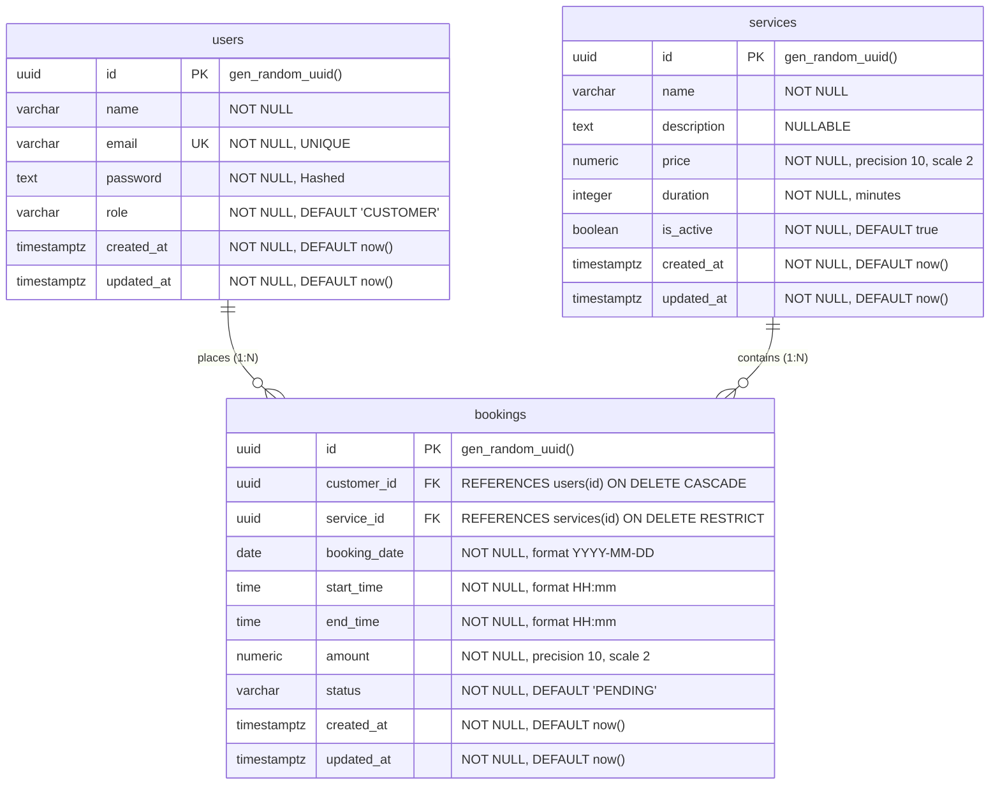

# Entity Relationship Diagram: Service Booking System

The following diagram illustrates the relational data model for the Service Booking System using PostgreSQL and Drizzle ORM.

---

## Relationship Semantics

### 1. User to Bookings (`users ||--o{ bookings`)
* **Multiplicity**: One User can place zero, one, or many Bookings (`1:N`).
* **Cascade Behavior**: If a user is removed, their associated bookings cascade delete (`ON DELETE CASCADE`).
* **Ownership**: Every booking strictly belongs to one customer (`customer_id`).

### 2. Service to Bookings (`services ||--o{ bookings`)
* **Multiplicity**: One Service can be referenced by zero, one, or many Bookings (`1:N`).
* **Protection Behavior**: Deletion of a service that has associated historical bookings is restricted (`ON DELETE RESTRICT`) to preserve audit and financial records. Administrators deactivate services (`is_active = false`) instead of hard deletion.
