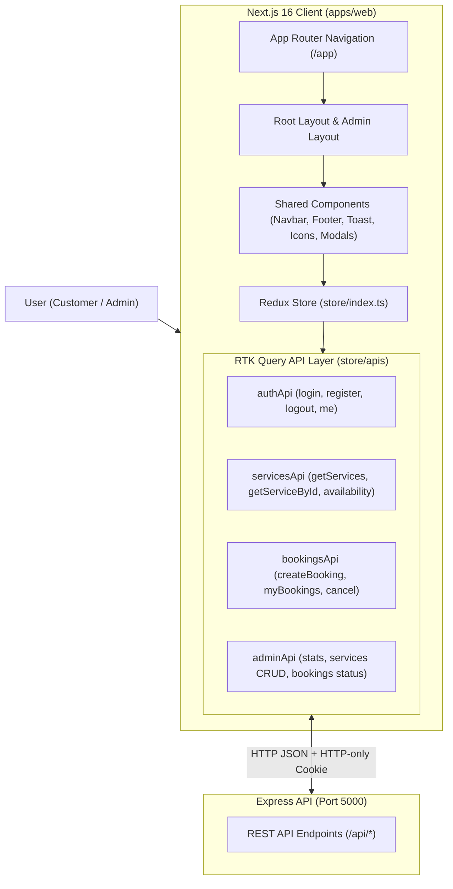
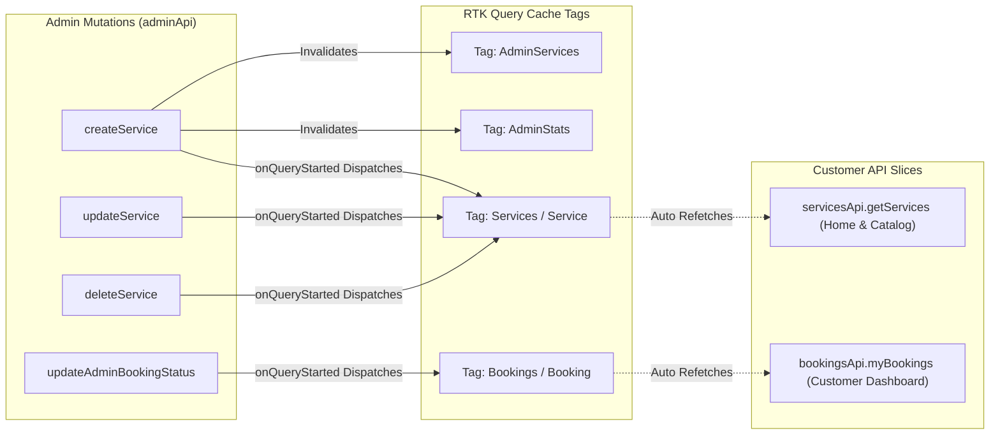

# Frontend Architecture & Technical Specification: Service Booking System

> **Client Experience Architecture**: A high-performance, fully responsive Next.js 16 App Router application built in React 19 and TypeScript, powered by Redux Toolkit Query, featuring a modern Vanilla CSS design system and enterprise-grade viewport management.

---

## 1. System Overview & Technology Stack

The frontend application (`apps/web`) is a modern web application designed for high usability, visual polish, and zero client-side data tampering. It communicates with the backend REST API exclusively through typed RTK Query endpoints.

| Layer | Technology | Purpose / Configuration |
| :--- | :--- | :--- |
| **Framework** | Next.js 16.3+ (App Router) | Server-side rendering, client routing, Turbopack dev server |
| **UI Library** | React 19 | Declarative UI components with hooks (`useState`, `useEffect`, `useMemo`, `useRef`) |
| **Language** | TypeScript 5+ | Strict type safety with shared `@repo/types` interfaces |
| **State Management** | Redux Toolkit & RTK Query | Normalized API caching, automatic tag invalidation, optimistic UI |
| **Styling & Design System** | Modern Vanilla CSS (`globals.css`) | Curated design tokens, CSS variables, micro-animations, glassmorphism |
| **Icons** | Custom SVG Component Suite | High-performance, zero-bundle-overhead SVG icons (`components/Icons.tsx`) |
| **Notifications** | Toast System (`components/Toast.tsx`) | Non-intrusive feedback for success, conflict, and error states |

---

## 2. High-Level Frontend Architecture



---

## 3. Complete Page-by-Page Breakdown

Every route in the application is engineered for responsiveness, performance, and seamless user feedback.

```
apps/web/app/
├── (public)
│   ├── page.tsx                     # / (Landing Page)
│   ├── services/
│   │   ├── page.tsx                 # /services (Catalog)
│   │   └── [id]/page.tsx            # /services/[id] (Service Details)
│   ├── login/page.tsx               # /login (Sign In Portal)
│   └── register/page.tsx            # /register (Sign Up Portal)
├── (customer)
│   ├── book/[serviceId]/page.tsx    # /book/[serviceId] (Booking Flow)
│   ├── bookings/
│   │   ├── page.tsx                 # /bookings (My Appointments)
│   │   └── [id]/page.tsx            # /bookings/[id] (Tracking Timeline)
│   └── profile/page.tsx             # /profile (Customer Profile)
└── admin/
    ├── layout.tsx                   # Dedicated Fixed Viewport Admin Layout
    ├── page.tsx                     # /admin (Command Center Dashboard)
    ├── bookings/page.tsx            # /admin/bookings (Operations Management)
    ├── services/page.tsx            # /admin/services (Catalog Management)
    ├── profile/page.tsx             # /admin/profile (Admin Settings)
    └── login/page.tsx               # /admin/login (Dedicated Admin Sign-In)
```

---

### 3.1 Public Storefront Pages

#### 1. Home / Landing Page (`/` — `app/page.tsx`)
* **Purpose**: Primary marketing and customer entry point.
* **Key Features**:
  * **Hero Section**: Value proposition, primary call-to-actions, and an interactive **Live Booking Preview** card dynamically displaying the latest active service from the backend.
  * **Trust Assurance Bar**: Highlighting guaranteed slots, zero double-booking architecture, transparent rates, and certified specialists.
  * **Popular Services Grid**: Displays the top 4 active services ordered strictly by **newest first** (`createdAt DESC`). Each card displays pricing, duration, fallback category imagery, and direct booking links.
  * **How Booking Works (3-Step Guide)**: Visual process timeline (Select Service $\rightarrow$ Pick Live Slot $\rightarrow$ Instant Confirmation).
  * **Why Choose Us Section**: Enterprise reliability metrics, conflict prevention highlights, and guaranteed scheduling.
  * **Call To Action Banner**: High-conversion footer banner directing users to the full service catalog.

#### 2. Services Discovery Catalog (`/services` — `app/services/page.tsx`)
* **Purpose**: Comprehensive catalog for browsing, searching, and filtering active services.
* **Key Features**:
  * **Real-Time Search**: Debounced search input matching service name and description.
  * **Duration Filter**: Categorization dropdown (All Durations, $\le 30$ min, $30–60$ min, $> 60$ min).
  * **Newest-First Default Sorting**: Automatically sorts catalog with newly added services at the top (`Sort: Newest First`), with options for Price: Low to High, Price: High to Low, and Alphabetical.
  * **Responsive Grid Layout**: Fluid card grid (`repeat(auto-fill, minmax(min(100%, 280px), 1fr))`) preventing horizontal overflow on all screen sizes.
  * **Loading Skeletons & Empty State**: Elegant skeleton cards during fetch and friendly reset buttons when zero matches are found.

#### 3. Service Details Page (`/services/[id]` — `app/services/[id]/page.tsx`)
* **Purpose**: Deep-dive service overview before initiating appointment booking.
* **Key Features**:
  * Dynamic breadcrumb navigation (`Home > Services > Service Name`).
  * Price and duration badges, verified specialist badge.
  * Comprehensive service scope breakdown, what's included, and operating hours notice.
  * Prominent **"Book This Service"** action navigating directly to the interactive booking flow.

---

### 3.2 Customer Experience & Booking Pages

#### 4. Interactive Booking Flow (`/book/[serviceId]` — `app/book/[serviceId]/page.tsx`)
* **Purpose**: Two-step scheduling interface with real-time slot conflict detection.
* **Key Features**:
  * **Date Picker**: Restricts selection to valid future dates (disables past dates).
  * **Live Availability Slot Engine**: Automatically triggers `useGetServiceAvailabilityQuery` on date change.
  * **Visual Slot Selector**: Displays discrete time slots (e.g. 09:00 AM, 10:00 AM) color-coded by availability:
    * *Available*: Selectable, hover highlight.
    * *Booked*: Disabled, marked with collision badge.
  * **Booking Summary Panel**: Displays selected service, date, time window, and server-calculated price.
  * **Atomic Submission**: Submits only `{ serviceId, bookingDate, startTime }`.
  * **Collision Feedback (409 Conflict)**: If another user reserves the slot simultaneously, displays immediate conflict toast, re-fetches open slots, and prompts selection of an alternate time.
  * **Success Redirection**: Navigates customer directly to their new booking tracking page.

#### 5. Customer Bookings History (`/bookings` — `app/bookings/page.tsx`)
* **Purpose**: Customer dashboard to review all past, upcoming, and pending appointments.
* **Key Features**:
  * **Summary KPI Cards**: Quick overview of Total Bookings, Pending, Confirmed, and Completed.
  * **Status Filter Tabs**: Seamless tab filtering (`ALL`, `PENDING`, `CONFIRMED`, `COMPLETED`, `CANCELLED`).
  * **Dual Responsive Layout**:
    * *Desktop ($\ge 900px$)*: High-density data table with customer, service, date, time, price, status badge, and actions.
    * *Mobile ($< 900px$)*: Card-based layout with touch-friendly cancellation and inspection buttons.
  * **Cancellation Dialog**: Interactive modal allowing customers to cancel pending or confirmed appointments with instant optimistic cache updates.

#### 6. Booking Details & Tracking Timeline (`/bookings/[id]` — `app/bookings/[id]/page.tsx`)
* **Purpose**: Detailed appointment status tracker.
* **Key Features**:
  * **Visual Progress Timeline**: Step-by-step state tracker showing progression through `PENDING` $\rightarrow$ `CONFIRMED` $\rightarrow$ `COMPLETED` (or `CANCELLED`).
  * **Service & Financial Breakdown**: Formal receipt showing duration, service name, scheduled window, and total charged.
  * **Quick Actions**: One-click cancellation dialog (if cancellable) or direct link to re-book.

---

### 3.3 Authentication & Profile Pages

#### 7. Unified Sign In (`/login` — `app/login/page.tsx`)
* **Purpose**: Secure authentication portal for both Customers and Administrators.
* **Key Features**:
  * Email and password fields with password visibility toggle.
  * **Quick-Fill Demo Chips**: One-click fill buttons for `Admin Demo` and `Customer Demo`.
  * **Role-Aware Smart Redirection**:
    * Admins are routed immediately to the `/admin` Operations Command Center.
    * Customers are routed to the service catalog or their intended booking page.
  * Secure HTTP-only cookie establishment.

#### 8. Customer Registration (`/register` — `app/register/page.tsx`)
* **Purpose**: Onboarding portal for new customers.
* **Key Features**:
  * Name, email, and password confirmation validation.
  * Immediate session creation upon registration (no extra login step required).
  * Direct onboarding redirect to the service catalog.

#### 9. Customer Profile (`/profile` — `app/profile/page.tsx`)
* **Purpose**: Account overview and session management.
* **Key Features**:
  * User avatar badge, full name, email address (with `word-break: break-all` protection), and role tag.
  * Account creation timestamp.
  * Direct links to My Bookings and Sign Out.

---

### 3.4 Enterprise Operations & Admin Pages

The entire administrative portal runs under a dedicated layout (`app/admin/layout.tsx`) utilizing a **Fixed Viewport Architecture**.

#### 10. Admin Operations Dashboard (`/admin` — `app/admin/page.tsx`)
* **Purpose**: Executive operations center with real-time business metrics.
* **Key Features**:
  * **Metric KPI Cards**: Total Realized Revenue (₹), Active Services, Total Bookings Count, Today's Scheduled Appointments.
  * **Booking Status Distribution Bar**: Proportional, multi-color distribution bar showing exact percentages of Completed, Confirmed, Pending, and Cancelled bookings.
  * **Recent Bookings Feed**: Live data table showing the latest customer appointments placed, with one-click inspection triggers.

#### 11. Admin Bookings Management (`/admin/bookings` — `app/admin/bookings/page.tsx`)
* **Purpose**: Complete administrative booking management and lifecycle transitions.
* **Key Features**:
  * **Multi-Parameter Filtering**: Real-time customer search (name or email), status dropdown filter, and calendar date filter.
  * **Pagination Controls**: Previous/Next navigation with page-size controls.
  * **Interactive Status Transition Modal**: Admins can approve (`CONFIRMED`), complete (`COMPLETED`), or cancel (`CANCELLED`) bookings with state machine validation.
  * **Dual Responsive Layout**: Auto-toggles between desktop data table and mobile operation cards at 900px.

#### 12. Admin Services Catalog Management (`/admin/services` — `app/admin/services/page.tsx`)
* **Purpose**: Complete CRUD operations for bookable services.
* **Key Features**:
  * **Service Listing Table**: Name, image preview, description, duration, price, active/inactive badge, and actions.
  * **Create Service Modal**: Form with name, description, duration in minutes, price, and image URL.
  * **Edit Service Modal**: Pre-populated update form.
  * **Soft-Delete / Deactivation Modal**: Deactivates services (`isActive = false`) to protect historical booking records without foreign key violations.
  * **Instant User Sync**: Triggers automatic RTK Query cache invalidation across the public customer catalog.

#### 13. Admin Profile & System Status (`/admin/profile` — `app/admin/profile/page.tsx`)
* **Purpose**: Administrator account details and platform privileges.
* **Key Features**:
  * Administrator credential summary, security badges, and quick session sign-out.

#### 14. Admin Dedicated Login (`/admin/login` — `app/admin/login/page.tsx`)
* **Purpose**: Streamlined administrator sign-in portal bypassing standard storefront chrome.

---

## 4. State Management & Redux Toolkit (RTK) Query

All client-server network interactions are coordinated through Redux Toolkit Query (`store/apis/`), ensuring normalized caching, zero redundant requests, and automatic synchronization across browser tabs.

### 4.1 API Slices & Tag Invalidation Architecture



### 4.2 Cross-Slice Cache Synchronization Strategy
Because `adminApi` and `servicesApi` are separate `createApi` instances, mutations in `adminApi` utilize `onQueryStarted` lifecycle listeners:
```typescript
createService: builder.mutation<ApiResponse<Service>, CreateServiceDto>({
  query: (body) => ({ url: "/services", method: "POST", body }),
  invalidatesTags: ["AdminServices", "AdminStats"],
  async onQueryStarted(_arg, { dispatch, queryFulfilled }) {
    try {
      await queryFulfilled;
      // Invalidate customer-facing services cache immediately!
      dispatch(servicesApi.util.invalidateTags(["Services", "Service"]));
    } catch {}
  },
}),
```
This guarantees that the instant an admin creates or modifies a service, the customer-facing Home Page and Catalog refresh immediately with newest services at the top.

---

## 5. Design System & Responsive Architecture

### 5.1 Enterprise Fixed Viewport Architecture (Admin)
To prevent the admin sidebar from scrolling out of view or wobbling during page navigation, the admin console implements a locked viewport layout:

* **`.admin-root-container`**: Anchored to `height: 100vh; height: 100dvh; overflow: hidden;`.
* **`.admin-topbar`**: Fixed `height: 60px; flex-shrink: 0;` docked at the very top.
* **`.admin-layout-wrapper`**: Locked to `height: calc(100vh - 60px); overflow: hidden;`.
* **`.admin-desktop-sidebar`**: Docked on the left with `height: 100%; overflow-y: auto; overflow-x: hidden;`. **It never scrolls with page content.**
* **`.admin-content-area`**: Independent scrolling container with `height: 100%; overflow-y: auto; overflow-x: hidden; -webkit-overflow-scrolling: touch;`. Only dashboard tables and cards scroll.

### 5.2 Mobile Drawer & Navigation Handling
* **Auto-Close on Route Change**: Listens to Next.js `pathname` changes to dismiss the mobile drawer automatically when any link is clicked.
* **Auto-Close on Back Button**: Listens to the browser `popstate` event to close open drawers when the mobile hardware or browser back button is pressed.
* **Escape Key Dismissal**: Binds `keydown` for accessibility compliance.

### 5.3 Responsive Breakpoints & Overflow Prevention
* **Global Text Containment**: `*, *::before, *::after` enforce `overflow-wrap: break-word;` so email addresses and IDs never stretch the viewport width.
* **Data Table Containment**: All tables are wrapped in `.table-container` with `overflow-x: auto;`, providing smooth horizontal scrolling on mobile without corrupting page layouts.
* **Fluid Grids**: Cards utilize `repeat(auto-fit, minmax(min(100%, 250px), 1fr))` to scale smoothly from 320px smartphones to 4K desktop displays.

---

## 6. Directory Structure & Key Files

```
apps/web/
├── app/
│   ├── admin/
│   │   ├── bookings/page.tsx        # Admin Bookings Portal
│   │   ├── services/page.tsx        # Admin Services Management
│   │   ├── profile/page.tsx         # Admin Profile Settings
│   │   ├── login/page.tsx           # Admin Dedicated Sign-In
│   │   ├── layout.tsx               # Fixed Viewport Admin Frame & Sidebar
│   │   └── page.tsx                 # Operations Dashboard
│   ├── book/[serviceId]/page.tsx    # Interactive Booking Flow
│   ├── bookings/
│   │   ├── [id]/page.tsx            # Booking Tracking Timeline
│   │   └── page.tsx                 # Customer Bookings History
│   ├── services/
│   │   ├── [id]/page.tsx            # Service Detail Page
│   │   └── page.tsx                 # Service Discovery Catalog
│   ├── login/page.tsx               # Customer & Admin Login
│   ├── register/page.tsx            # Customer Registration
│   ├── profile/page.tsx             # Customer Profile Overview
│   ├── globals.css                  # Core Design System, Variables, Layouts
│   ├── layout.tsx                   # StoreProvider, Navbar, Footer Root Frame
│   └── page.tsx                     # Landing Page (Hero, Live Preview, Featured)
├── components/
│   ├── Icons.tsx                    # Lightweight SVG Icon System
│   ├── Navbar.tsx                   # Public & Customer Navigation Header
│   ├── Footer.tsx                   # Multi-column Responsive Footer
│   └── Toast.tsx                    # Real-time Notification Banner
├── config/
│   └── env.ts                       # Frontend API URL configuration
├── store/
│   ├── apis/
│   │   ├── auth.api.ts              # Authentication endpoints & sessions
│   │   ├── services.api.ts          # Public catalog & availability queries
│   │   ├── bookings.api.ts          # Customer appointment bookings
│   │   └── admin.api.ts             # Admin metrics, CRUD, and status updates
│   ├── rootReducer.ts               # Combined Redux reducer
│   └── index.ts                     # Redux Toolkit store initialization
└── package.json
```

---

## 7. Development Setup & Environment Variables

### 7.1 Required Environment Variables (`apps/web/.env`)
```env
NEXT_PUBLIC_APP_URL="http://localhost:5000"
```

### 7.2 Development & Build Commands
```bash
# Start Next.js development server with Turbopack (Port 3000)
npm run dev

# Run TypeScript type verification across all routes
npm run check-types

# Run ESLint static analysis
npm run lint

# Build optimized production bundle
npm run build
```
